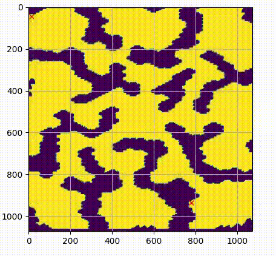

# ImageRRT: An RRT Pathfinding Visualizer
This repository contains Python scripts for a pathfinding visualizer based on the [Rapidly-Exploring Random Tree (RRT)](https://en.wikipedia.org/wiki/Rapidly_exploring_random_tree) algorithm. 
It works with 2D images, converts them to grayscale, and allows users to pick two points to find the path between them.
<p align="center">
  
</p>

## Usage
1. Install required dependencies ([NumPy](https://pypi.org/project/numpy/), [matplotlib](https://pypi.org/project/matplotlib/), [Pillow](https://pypi.org/project/pillow/)):
```bash
pip install -r requirements.txt
```

2. Run ```visualize.py```. You'll need to adjust the `filepath` in `visualize.py`, `main()` to point to a valid image.
   
4. Choose two points on the image.
   
6. The script will attempt to solve the pathfinding problem based on the provided variables (see below).

## Variables

Some adjustable variables for customizing searches.

| Name | Purpose | File/Function |
| :---         |     :---:      |          ---: |
| `filepath`   | path to valid image ("maps/path1.png")     | `visualize.py`, `main()`    |
| `max_search_iters`   | maximum number of search iterations     | `visualize.py`, `main()`    |
| `disp_progress`   | boolean to show search progress     | `visualize.py`, `main()`    |
| `exploration_bias`   | bias towards exploring near goal     | `visualize.py`, `rrt_planner()`    |
| `goal_bias_radius`   | biased search radius around the goal     | `visualize.py`, `rrt_planner()`    |
| `goal_bias`   | bias towards exploring directly at goal coordinate     | `visualize.py`, `rrt_planner()`    |
| `distance_to_goal_radius`   | radius for goal proximity in solution checking     | `visualize.py`, `rrt_planner()`    |
| `threshold`   | threshold for image conversion     | `read_map.py`, `get_bnw_image()`    |

## References

The maps used in this project are sourced from the [MovingAI Starcraft 2D Pathfinding Benchmarks](https://movingai.com/benchmarks/grids.html)

